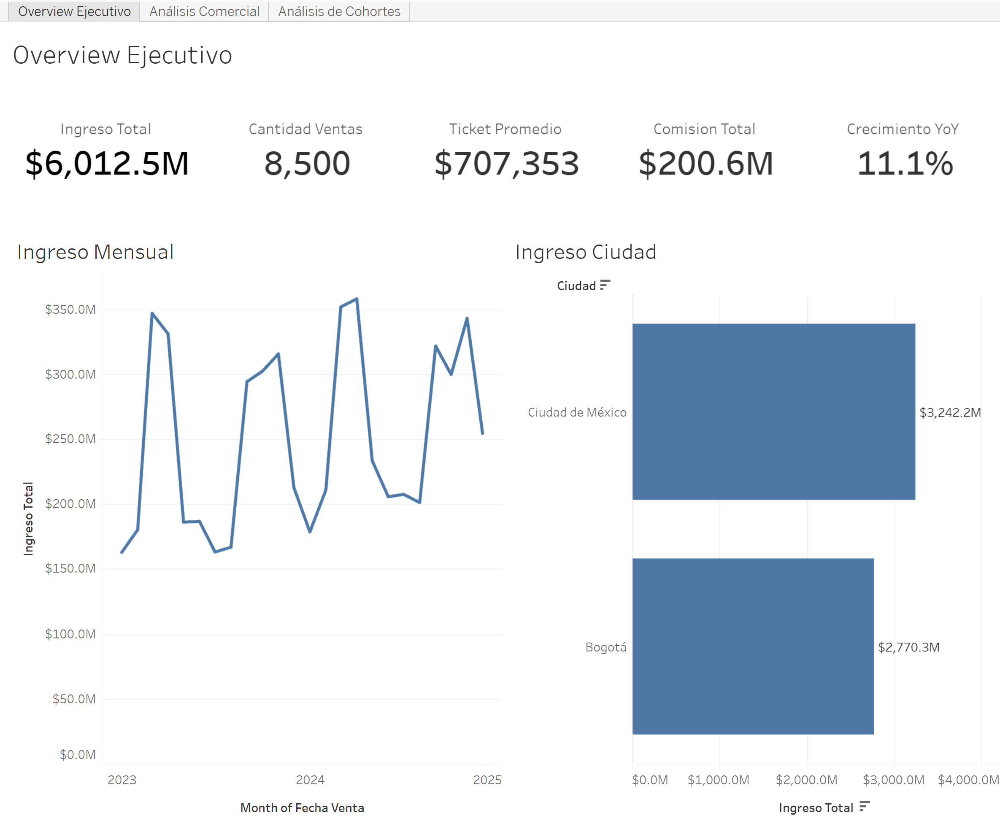
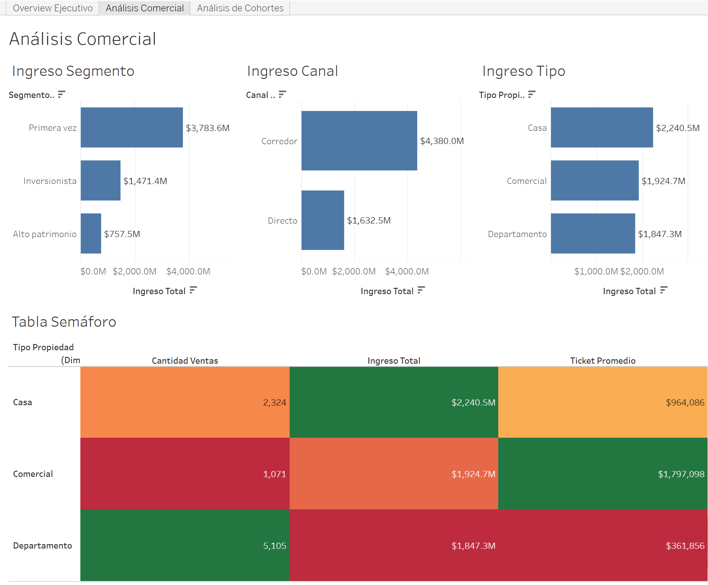
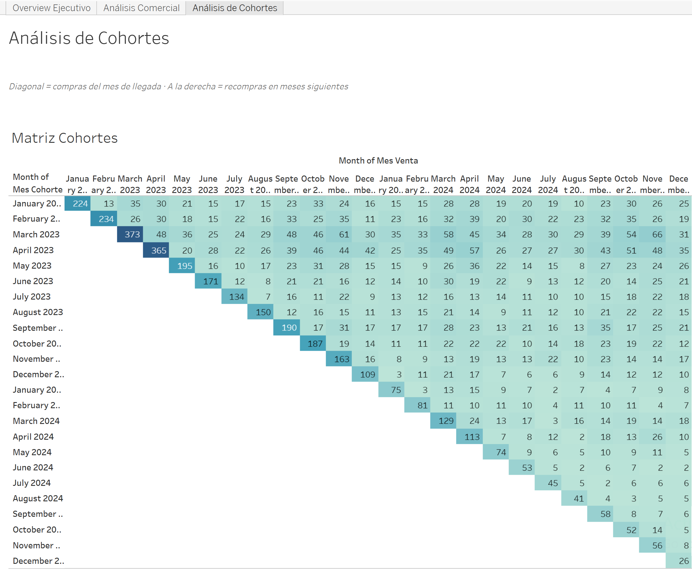

# Commercial Strategy Dashboard — Andes Capital Real Estate (Tableau)

Three-page Tableau dashboard analysing 8,500 property sales (2023–2024) in Bogotá and Mexico City, built to answer what drives revenue, whether the business is growing, and whether customers come back.

**[View the interactive dashboard on Tableau Public →](https://public.tableau.com/views/AndesCapital-Proyecto10/AnlisisComercial)**

## Business Question

Andes Capital sells houses, apartments and commercial properties through brokers and direct sales. The data existed only at transaction level, so management had no clear view of the business. The dashboard had to answer six questions:

| Question | Where it is answered |
|---|---|
| How much revenue did we generate? | KPI cards — Executive Overview |
| Which property type generates the most revenue? | Revenue by type + traffic-light table |
| Which customer segments buy the most? | Revenue by segment |
| How do sales evolve over time? | Monthly revenue trend |
| Is the business growing year over year? | YoY growth KPI |
| Do customers come back after their first purchase? | Cohort matrix |

## Dataset

A star schema with one fact table and two dimensions:

| Table | Grain | Rows | Key columns |
|---|---|---|---|
| `hecho_ventas_propiedades` | One row per sale | 8,500 | `id_venta`, `fecha_venta`, `id_cliente`, `id_propiedad`, `precio_venta`, `canal_venta`, `monto_comision` |
| `dim_clientes` | One row per customer | 3,500 | `id_cliente`, `segmento_comprador`, `pais`, `ciudad` |
| `dim_propiedades` | One row per property | 8,000 | `id_propiedad`, `tipo_propiedad`, `barrio`, `habitaciones`, `tamano_m2` |

The CSV files are in [`data/`](data/).

## Data Validation

Before modelling, every table was checked for the issues that silently break a dashboard:

| Check | Method | Result | Why it matters |
|---|---|---|---|
| Data types | Field type icons in the data source | All correct | A date read as text breaks the trend, YoY and cohorts |
| Null values | `IF ISNULL(...) OR ... THEN 1 ELSE 0 END`, summed per table | 0 in all three tables | Nulls create a "Null" category that distorts shares |
| Duplicate keys | `COUNT(id) - COUNTD(id)` on each dimension | 0 duplicates | A duplicated customer would double-count their revenue |
| Commission format | Default number format → Percentage | 3.32% average | Changes how the value displays, not the value itself |

No records were removed or imputed: the data was complete.

## Data Model

`hecho_ventas_propiedades` sits at the centre, related to `dim_clientes` on `id_cliente` and to `dim_propiedades` on `id_propiedad`, both many-to-one. Dimensions never connect to each other.

Tableau **relationships** were used instead of joins: tables stay separate and are combined only at query time, so a key problem can never multiply rows.

## Calculated Fields

Field names are in Spanish, as they appear in the dashboard.

| Field | Formula | Why |
|---|---|---|
| Ingreso Total | `SUM([Precio Venta])` | Total transaction value |
| Cantidad Ventas | `COUNTD([Id Venta])` | Number of sales |
| Ticket Promedio | `[Ingreso Total] / [Cantidad Ventas]` | Built on the two measures above, so a definition change propagates |
| Comisión Total | `SUM([Monto Comision])` | What the company actually keeps |
| % Part. Tipo / Canal / Segmento | `MIN({FIXED [Dimension] : SUM([Precio Venta])}) / MIN({FIXED : SUM([Precio Venta])})` | Share of revenue. The numerator is fixed at the category level and the denominator at the whole business, independent of the view |
| Ventas Año Actual | `SUM(IF YEAR([Fecha Venta]) = {MAX(YEAR([Fecha Venta]))} THEN [Precio Venta] END)` | Latest year, detected dynamically rather than hard-coded |
| Ventas Año Anterior | Same, with `{MAX(YEAR([Fecha Venta]))} - 1` | The comparison base |
| Crecimiento YoY | `([Ventas Año Actual] - [Ventas Año Anterior]) / [Ventas Año Anterior]` | Year-over-year growth |
| Primera Compra | `{FIXED [Id Cliente] : MIN([Fecha Venta])}` | Each customer's acquisition date |
| Mes Cohorte | `DATETRUNC('month', [Primera Compra])` | Acquisition month |
| Mes Venta | `DATETRUNC('month', [Fecha Venta])` | Month of each purchase |

## Headline Numbers

| KPI | Value |
|---|---|
| Total revenue | $6,012.5M |
| Number of sales | 8,500 |
| Average ticket | $707,353 |
| Total commission | $200.6M (3.3% of revenue) |
| YoY growth | **+11.1%** ($2,847.7M in 2023 → $3,164.8M in 2024) |

## What the Dashboard Shows

### Each property type wins at something different

| Type | Revenue | Sales | Average ticket |
|---|---|---|---|
| House | **$2,240.5M** (37.3%) | 2,324 | $964,086 |
| Commercial | $1,924.7M (32.0%) | 1,071 | **$1,797,098** |
| Apartment | $1,847.3M (30.7%) | **5,105** | $361,856 |

Apartments account for 60% of units sold but the lowest revenue. Commercial properties sell the fewest units at the highest ticket. Houses generate the most revenue. A single "best type" does not exist: it depends on whether the goal is volume, revenue or ticket size.

### Mexico City sells less but earns more

Bogotá closes more sales (4,377 vs 4,123), but Mexico City generates 53.9% of revenue because its average ticket is 24% higher ($786K vs $633K). Bogotá already has the volume; the opportunity is in what it sells.

### The broker channel carries the commission

Brokers bring 72.9% of revenue and **88% of commission**: they charge about 4.0% per sale against 1.5% for direct sales. Average ticket is almost identical in both channels (~$705K), so the broker advantage comes from volume, not price.

### Sales are seasonal

Revenue peaks in March–April and September–November and dips in January and June–August, in both years. The pattern is predictable, which makes it plannable.

### Customers return, but fewer new ones arrive

- **61% of all sales are repeat purchases.** 77% of buyers purchased more than once.
- The March and April 2023 cohorts generated the most repeat activity (829 and 720 purchases after their first month).
- **New customer acquisition fell 67%**, from 2,366 in 2023 to 773 in 2024.
- **69% of 2024 revenue came from customers acquired in 2023.**

The 11% growth is real, but it is driven by retention, not acquisition. That is healthy in the short term and a risk in the long term: once the 2023 base stops buying, there is no new base to replace it.

## Executive Summary (SCQA)

> **Situation.** Andes Capital generated $6,012.5M across 8,500 sales in 2023–2024, growing 11.1% year over year.
>
> **Complication.** New customer acquisition fell 67% in 2024, and 69% of that year's revenue came from customers acquired the year before.
>
> **Question.** Is the current growth sustainable?
>
> **Answer.** Not without new customers. Retention is strong; acquisition is the gap.

**Recommendations**

1. **Reactivate acquisition**, timing campaigns to the seasonal peaks (March–April, September–November).
2. **Strengthen the broker channel**, which generates 88% of commission.
3. **Prioritise houses for revenue** and develop commercial properties as a high-value line.
4. **Apply Mexico City's ticket mix to Bogotá**, which already has the sales volume.
5. **Replicate the 2023 retention** in recent cohorts.

## Design Decisions

**Three pages, split by question.** The Executive Overview answers *how are we doing*, Commercial Analysis answers *what drives it*, and the Cohort page answers *do customers come back*. Mixing them makes every chart compete for attention.

**Separate colour scales in the traffic-light table.** Revenue is in billions and sales in thousands. With a single scale, revenue would flatten every other column into the same colour. Each metric is coloured only against itself.

**City as an interactive filter.** Clicking a city on the Overview filters the KPIs and the trend, so each market can be read on its own without a second dashboard.

**Horizontal bars for categories.** Long labels like "Ciudad de México" stay readable without rotation.

## Files

- [`dashboard-overview.png`](dashboard-overview.png) — Executive Overview
- [`dashboard-commercial.png`](dashboard-commercial.png) — Commercial Analysis
- [`dashboard-cohorts.png`](dashboard-cohorts.png) — Cohort Analysis
- [`data/`](data/) — source CSV files

## Tools

- Tableau Public — data model (relationships), calculated fields, LOD expressions, dashboards

## Author

**Sebastian Ladino Novoa** — Data Analytics Portfolio
